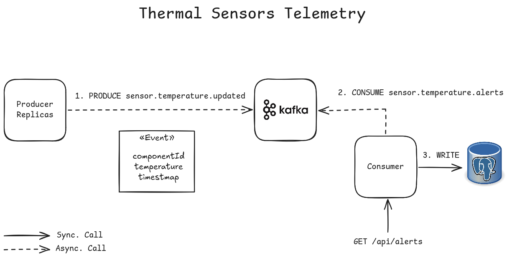
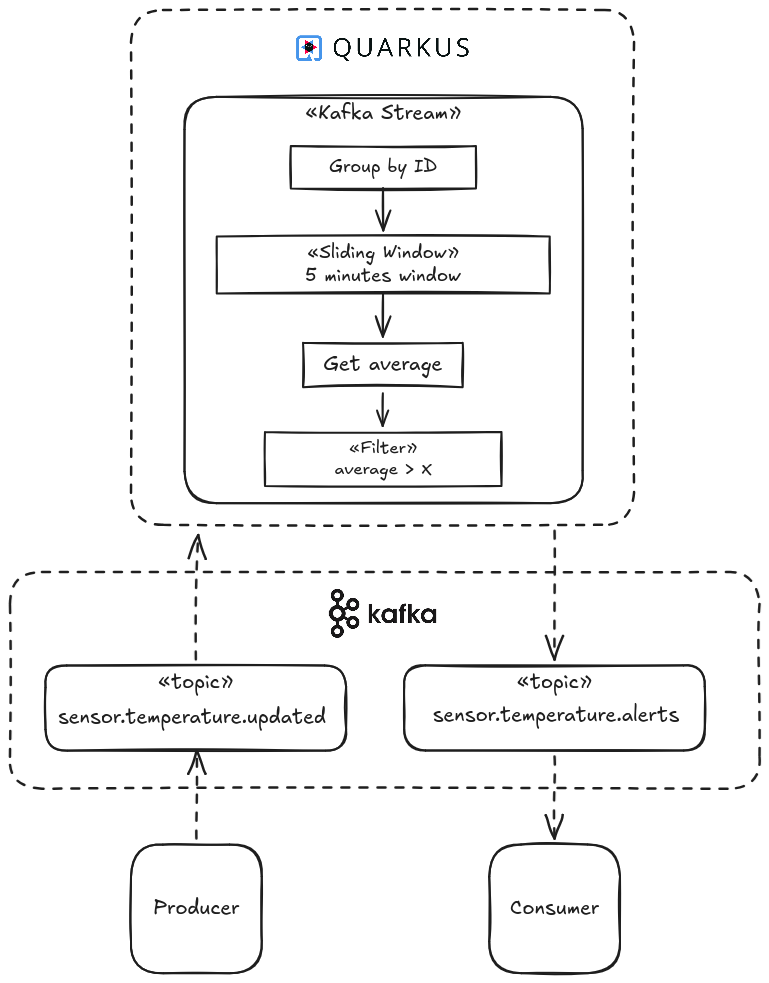

# Quarkus Kafka Sandbox

Study project implementing Apache Kafka using Quarkus.


## Technologies

- Java 21
- Quarkus 3.37
- Caffeine Cache
- PostgreSQL 17
- Apache Kafka 3.8 (KRaft)
- KafkaUI
- Docker

## Domain

The purpose is to create a simple IoT simulation with constant events and analytics. 

Every 2 seconds the producers (3 replicas) update their current temperatures and send them to Kafka. The events are processed by Kafka Streams and sent to the `sensor.temperature.alerts` topic, where they are consumed. 



### Telemetry Analytics Stream

Kafka Stream implemented on [producer](producer/src/main/java/sandbox/producer/config/KafkaConfig.java).



### Consumer

The consumer handles alert events with cache-based TTL using Caffeine. If the component has already been alerted within the last 5 minutes, the notification is ignored.
All alerts can be found on `http://localhost:8080/api/notifications`.


## How to execute

```bash
docker compose up -d --build
```


- KafkaUI will be available on `http://localhost:8081`.
- Notification service will be available on `http://localhost:8080`

---